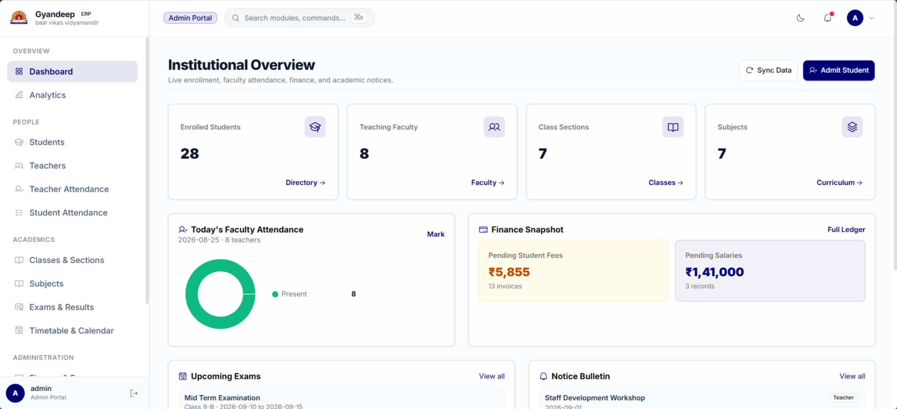
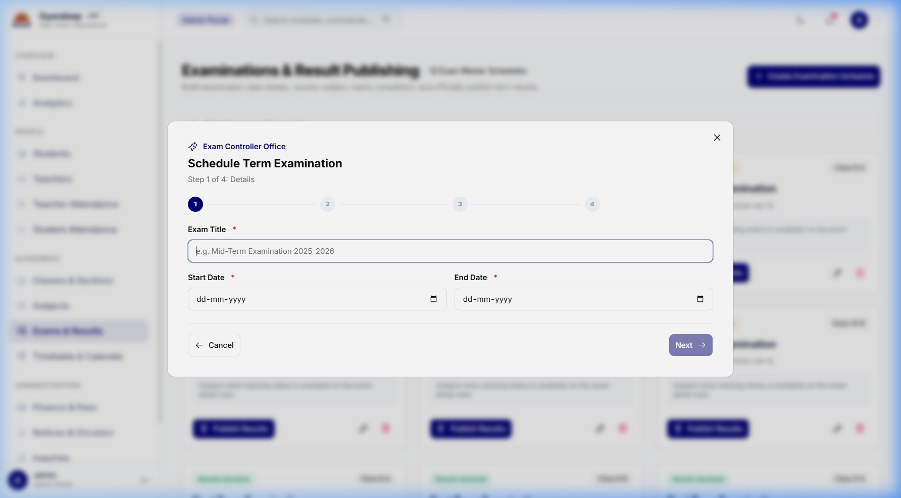
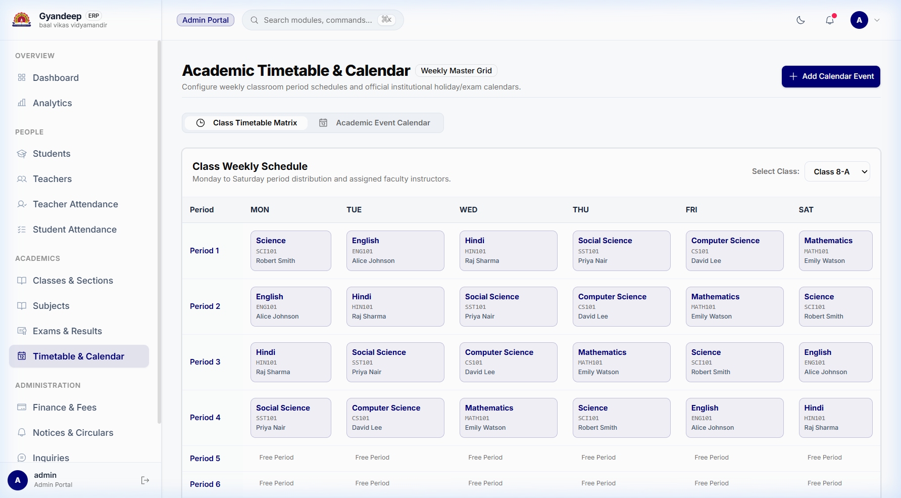
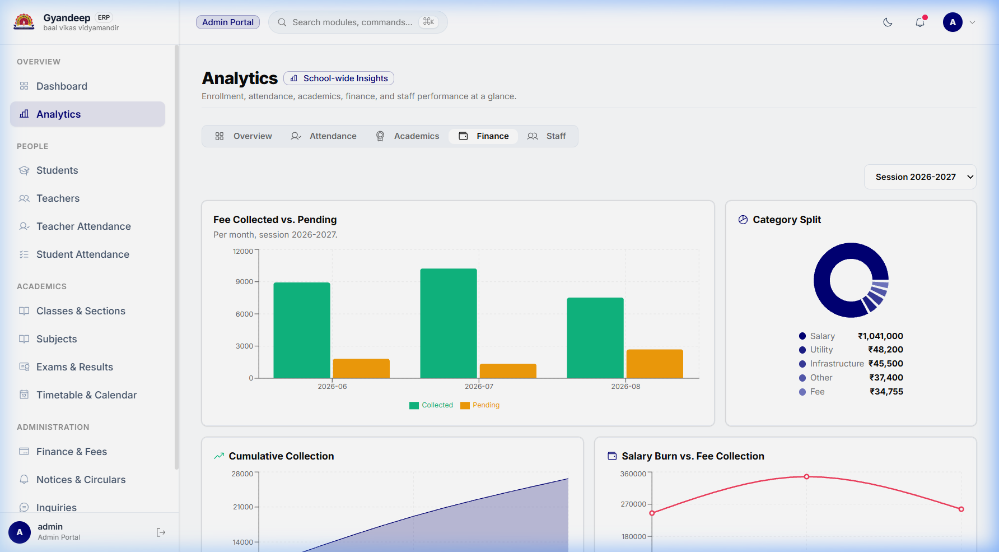

<div align="center">

# SchoolERP

**A school management system with four role-based portals, built end to end on one shared type contract.**

Admin, Teacher, Student and Finance each get their own application — their own dashboard, their own permissions, and their own view of the same data.


</div>

---

## Screenshots

> **TODO — drop four PNGs into `docs/screenshots/`, then delete this note and uncomment the table
> immediately below it.** Named `admin-dashboard.png`, `exam-wizard.png`, `timetable-builder.png`
> and `finance-analytics.png`, they will slot straight in. The table is commented out so the README
> never renders broken images.

<!-- SCREENSHOTS — uncomment once the four files exist in docs/screenshots/
|  |  |
|:--:|:--:|
|  |  |
| **Admin dashboard** | **Exam creation wizard** |
|  |  |
| **Timetable builder** | **Finance analytics** |
-->

---

## What it is

Most school software does one thing well and fakes the rest — attendance is solid but fees live in a
spreadsheet, or fees are solid and teachers still print the timetable on Sunday night. SchoolERP is a
single system where a mark, a fee and a result share the same database and the same type definitions.

It covers the full operational loop of a school: enrolment, class and subject structure, timetabling,
attendance, examinations and results, fee collection, salary disbursal, expenses, notices, and
end-of-session promotion.

**At a glance**

| | |
|---|---|
| REST endpoints | 114 across 7 route modules |
| Database models | 19 (Prisma + MongoDB) |
| Screens | 55 page components |
| Integration tests | 74, over real HTTP |
| Codebase | ~38,700 lines of TypeScript in 352 files |
| Role portals | Admin, Teacher, Student, Finance |

---

## Features

### Admin
Full control of the institution. Student and teacher records with create, edit, detail views and
admin-triggered password resets. Class and subject management. A multi-step exam wizard covering exam
creation, subject assignment and result entry. A drag-friendly timetable builder. Notices, contact
messages and academic calendar. Bulk student import from CSV. End-of-session promotion that moves a
whole cohort up a year and archives the old classes. Analytics across attendance, academics, staff and
finance.

### Teacher
Mark class attendance, enter and publish exam results, view the assigned timetable, and track personal
salary history and attendance.

### Student
Attendance record, exam results with per-subject detail, fee status and payment history, subject list,
timetable, notices and academic calendar.

### Finance
Fee collection and breakdown per student, teacher salary disbursal, free-text expense categories
(books, whiteboards, supplies, and so on), a general transaction ledger, and finance-specific analytics.

---

## Architecture

The system is an npm workspaces monorepo with three linked packages plus a standalone test package.

```
schoolerp/
├── contracts/     @schoolerp/contracts — one Zod schema per API operation
├── backend/       Express 5 + Prisma + MongoDB
├── frontend/      React 19 + Vite
└── test/          Jest + axios integration suite (independent package)
```

### The contracts layer

This is the part worth reading. In a typical full-stack project the same object is described in three
or four places — the database schema, the backend's request validation, whatever the controller happens
to return, and a hand-written interface in the frontend. Only some of those are enforced. The rest are
assumptions that drift.

`contracts/` removes the drift by making one Zod schema per API operation the single source of truth for
both the **request and the response**:

```
                      ┌─────────────────────────┐
                      │  @schoolerp/contracts   │
                      │  one Zod schema per op  │
                      │  (request + response)   │
                      └───────────┬─────────────┘
                    ┌─────────────┴─────────────┐
                    ▼                           ▼
      ┌──────────────────────────┐  ┌──────────────────────────┐
      │ backend/defineRoute()    │  │ frontend/typed-client    │
      │ • validates the request  │  │ • builds the request     │
      │ • type-checks its own    │  │ • types the response     │
      │   response before send   │  │ • zodResolver for forms  │
      └──────────────────────────┘  └──────────────────────────┘
```

A backend controller reduces to this — no manual validation, no hand-built response envelope, and the
handler will not compile if its return value does not match the contract:

```ts
export const createStudent = defineRoute(studentContract.create, async ({ body }) => {
  return studentService.create(body);
});
```

And the frontend call is typed from the very same object the server validated against:

```ts
const created = await api(studentContract.create, { body });
```

The consequence is that there is no hand-maintained types file on either side, and no `as SomeType`
casts — there is nothing left to cast.

> **After editing anything in `contracts/src`, run `npm run build -w contracts`.** The backend and
> frontend consume the built `dist/`, not the source.

### Backend request flow

```
route  →  controller (defineRoute + contract)  →  service (Prisma + business logic)
```

Auth uses JWTs delivered in httpOnly cookies with a silent refresh on 401. `verifyJWT` populates
`req.user` with the **User** row's id; controllers needing a Teacher or Student profile id call
`resolveTeacherId(req)` / `resolveStudentId(req)`. Role guards (`AdminOnly`, `TeacherOnly`,
`StudentOnly`) run after `verifyJWT`.

### Wire conventions

- Dates are ISO in both directions: `YYYY-MM-DD` for dates, `YYYY-MM` for months. `DD-MM-YYYY` is
  display-only, formatted in the frontend.
- Create and update mutations return the affected resource. Deletes return the business key.
- Detail, update and delete routes take the resource's **business key** in the URL (`studentId`,
  `teacherId`, `subjectCode`) — never a raw Mongo id.
- Errors carry a `code`, and validation failures include a flattened `issues: [{ path, message }]`.

---

## Tech stack

| Layer | Choices |
|---|---|
| Frontend | React 19, Vite, TypeScript, Tailwind v4, shadcn/ui, TanStack Query, TanStack Table, react-hook-form, Recharts, Zustand, react-router v7 |
| Backend | Express 5, TypeScript, Prisma 6, MongoDB, JWT, bcrypt, Winston, `ws`, express-rate-limit |
| Shared | Zod schemas in `@schoolerp/contracts` |
| Tooling | npm workspaces, ESLint, Prettier, Husky + lint-staged |
| Testing | Jest + axios, against a live server |

---

## Getting started

### Prerequisites

- Node.js 20+
- [Bun](https://bun.sh) (backend dev server and seed script)
- A MongoDB connection string (Atlas or local replica set — Prisma's `mongodb` provider requires one)

### Install

Install once at the repo root. This links `@schoolerp/contracts` into both `backend/node_modules` and
`frontend/node_modules`.

```bash
git clone https://github.com/PremRaj99/School-ERP.git
cd School-ERP
npm install
```

### Configure

```bash
cp backend/.env.example backend/.env
cp frontend/.env.example frontend/.env
```

Only these matter for local development — the remaining keys in `backend/.env.example` (AWS, Redis,
Google OAuth, payments) are placeholders for integrations that do not exist in the code yet.

| Variable | Where | Purpose |
|---|---|---|
| `DATABASE_URL` | backend | MongoDB connection string |
| `ACCESS_TOKEN_SECRET` | backend | JWT signing secret |
| `REFRESH_TOKEN_SECRET` | backend | Refresh token signing secret |
| `PORT` | backend | Defaults to `5000` |
| `NODE_ENV` | backend | `development` locally; **must** be `production` when deployed |
| `FRONTEND_URL` | backend | Allowed CORS origin |
| `VITE_API_URL` | frontend | Defaults to `http://localhost:5000/api/v1` |

### Run

Build the contracts package first, then start both sides:

```bash
npm run build:contracts

# terminal 1
cd backend && npm run dev      # http://localhost:5000

# terminal 2
cd frontend && npm run dev     # http://localhost:5173
```

For active work on the contracts, run `npm run dev -w contracts` in a third terminal to rebuild on save.

### Scripts

```bash
npm run typecheck          # typecheck all three workspaces
npm run build              # build contracts + frontend
npm run build:backend      # build contracts + backend

# inside backend/ or frontend/
npm run lint  |  npm run lint:fix  |  npm run format
```

---

## Testing

`test/` is an independent Jest package that exercises the backend over real HTTP — there is no mocking,
so **the backend must already be running** against a reachable database.

```bash
cd test
npm install
npm test                       # all 74 tests, --runInBand

npx jest admin-route           # a single suite
npx jest -t "creates a student" # a single test
```

---

## Deployment

Both halves deploy to Vercel as **two separate projects from the same repository**, each configured by a
committed `vercel.json`.

### Frontend project

| Setting | Value |
|---|---|
| Root Directory | `frontend` |
| Framework | Vite (auto-detected) |
| Environment | `VITE_API_URL` → your backend deployment URL |

`frontend/vercel.json` handles the SPA rewrite so that deep links like `/admin/students` resolve to
`index.html` instead of 404ing, and marks Vite's content-hashed assets as immutable.

### Backend project

| Setting | Value |
|---|---|
| Root Directory | `backend` |
| Environment | `DATABASE_URL`, `ACCESS_TOKEN_SECRET`, `REFRESH_TOKEN_SECRET`, `NODE_ENV=production`, `FRONTEND_URL` |

`backend/vercel.json` builds with the project's own toolchain (`prisma generate && tsc && tsc-alias`) and
routes every request into `backend/api/index.js`, a thin serverless entry that exports the Express app.

Two details make this work, and both are deliberate:

- **It requires `dist/`, not `src/`.** 83 files import through the `@/*` path alias. `tsc-alias` rewrites
  those to real relative paths at build time; pointing the function at TypeScript source would leave the
  aliases unresolved at runtime.
- **It does not use `src/index.ts`.** That entrypoint calls `setupLogWebSocket()`, which opens a long-lived
  HTTP server and tails a log file — neither is possible in a serverless function. `npm run dev` and
  `npm start` still use it, so the WebSocket log stream works everywhere except Vercel.

### Cross-site cookies

The two projects sit on different origins, so the auth cookies are cross-site. This already works, but
only because two things line up:

- `setCookie` switches to `secure: true, sameSite: 'none'` when `NODE_ENV === 'production'` — so
  **`NODE_ENV` must be `production` on the backend project**, or the browser will silently drop the cookie.
- CORS auto-allows any `*.vercel.app` origin, which covers production and preview deployments. Set
  `FRONTEND_URL` when you move to a custom domain.

### Alternative: container hosting

`backend/Dockerfile` is a working multi-stage Bun build. Hosting the backend on a container platform
(Render, Railway, Fly.io) instead of Vercel keeps the WebSocket log stream and avoids serverless cold
starts against MongoDB. The frontend stays on Vercel either way — only `VITE_API_URL` changes.

---

## Known limitations

Stated plainly, because they are real:

- **No CI pipeline.** Linting, typechecking and tests run locally and via a Husky pre-commit hook, not on push.
- **The WebSocket log stream does not run on Vercel.** It works under `npm run dev`, `npm start` and Docker.
- **`prisma/seed.ts` is stale.** It was written with direct `prisma.*.create` calls that bypass validation,
  so it produces `studentId`/`className` values that today's Zod schemas reject — several list endpoints
  will 500 against a database seeded with it. Fix the seed values before running it. It is also
  destructive: it re-seeds whatever database `DATABASE_URL` points at.
- **No online payment flow.** Fee records and a transaction ledger exist; a payment gateway does not.
- **`POST /auth/signup` is not contract-backed.** No page calls it — Admin creates the linked `User` record
  internally when creating a student or teacher — so it was left on the older validation pattern.

---

## Project documentation

- **[`ALIGNMENT_PLAN.md`](ALIGNMENT_PLAN.md)** — the phased plan that took the project to end-to-end type
  safety, with what shipped in each phase.
- **[`PAGES_PLAN.md`](PAGES_PLAN.md)** — the authoritative map of every page to its form fields and the API
  it calls.
- **[`CLAUDE.md`](CLAUDE.md)** — repository conventions and architecture notes.

---

## License

ISC
